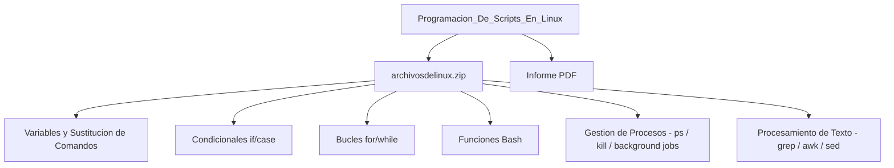

<div align="center">

# Programación de Scripts en Linux (Bash Scripting)


> Automatización de tareas de administración del sistema con Bash scripting en entorno Linux.

## Descripción

</div>

---

Laboratorio de programación de scripts en **Bash** para Linux: automatización de tareas del sistema operativo, gestión de archivos y directorios, procesamiento de texto con herramientas POSIX (`grep`, `awk`, `sed`), control de flujo, manejo de procesos en background y scripts de administración del sistema.

## Contenido del repositorio

| Archivo | Descripción |
|---|---|
| `archivosdelinux.zip` | Scripts Bash del laboratorio |
| `*.pdf` | Informe con scripts, ejecuciones y resultados |

## Arquitectura



## Scripts implementados

```bash
#!/bin/bash
# Ejemplos de conceptos implementados:

# Variables y sustitución de comandos
fecha=$(date +%Y-%m-%d)

# Condicionales
if [ -f "$archivo" ]; then chmod 755 "$archivo"; fi

# Bucles
for f in *.log; do gzip "$f"; done

# Funciones
backup() { tar -czf "$1.tar.gz" "$1" && echo "Backup: $1 OK"; }

# Gestión de procesos
ps aux | grep nginx | awk '{print $2}' | xargs kill -9
```

## Contexto académico

**Asignatura:** Programación bajo Unix · **Institución:** Ingeniería Informática
**Autor:** Alejandro De Mendoza — Ingeniero Informático · Especialista Ingeniería de Software

---

## Autor

**Alejandro De Mendoza**  
Ingeniero Informático · Especialista en IA · Especialista en Ingeniería de Software · Máster en Arquitectura de Software

[](https://github.com/AlejoTechEngineer)
